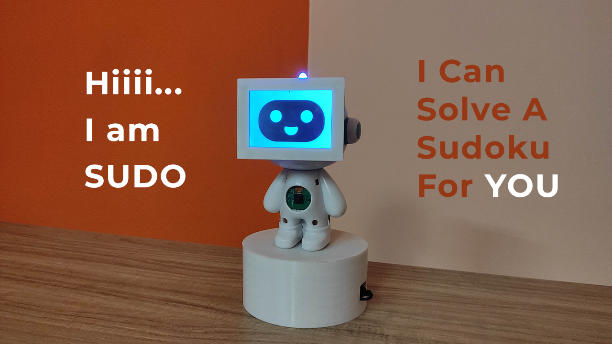

# Speech Controlled Sudoku Solving Robot
For most people, solving Sudoku is not a particularly simple task. A novice can need many hours to finish a straightforward sudoku problem. Because of this, we wondered if it was feasible to create a robot that could simply by looking at a sudoku problem, regardless of how difficult it is, solve it within a few seconds. Here the codes for a straightforward sudoku solver robot, to whom we can give voice commands and based on that it can quickly solve any sudoku puzzle for us. Also it will show us the whole procedure of solving the sudoku. You can see a quick demo of the robot at https://youtu.be/gCwES3D2PGY. 

## Features of the Robot:
Before we can discuss the build process of the robot, we need to know the features of it and how it works. Below you will find the working of this robot:
<ol>
  <li>After powering on the robot, it will be ready to take voice commands from the user.</li>
  <li>At the top of its head, this robot has a LED indicator. When the LED is turned on, the robot is listening to the user and when it's turned off, the      robot is processing the previous command.</li>
<li>The user can ask the robot to give an intro, and then the robot will give a brief intro as it has the speaking abilities.</li>
<li>The user can ask the robot to start solving the sudoku and then the robot will start video streaming.</li>
<li>Next, the user needs to hold a sudoku in front of the robot. It can be a sudoku on a paper or on the screen of a digital device. </li>
<li>After holding the sudoku in front of the robot, the user needs to ask the robot to capture the puzzle.</li>
<li>After capturing the puzzle, </li>
<ol><li>The robot will detect the sudoku from the image.</li>
<li>Extracts digits from the detected sudoku and forms the unsolved puzzle.</li>
<li>Applies a backtracking algorithm to solve the puzzle and shows the steps while solving the puzzle.</li>
<li>Finally after solving the puzzle it will show the solved puzzle on the screen and will wait for the user command to solve the next sudoku.</li>
  </ol>
<li>While solving the sudoku, the robot will inform us about all the steps with the help of its robotics voice.</li>
</ol>

## Required Libraries:

The following python libraries you need to install in Raspberry Pi for this project:
<ol><li>OpenCV: Used for image processing based tasks</li>
<li>Numpy: Used for working with arrays</li>
<li>Pytesseract: User for optical character recognition</li> 
<li>Pygame: Used to create GUIs</li>
<li>Speech Recognition: Used for speech recognition</li>
</ol>

## Useful Resources:
While building the solution, the following resources were very useful:

https://github.com/cunananm2000/Sudoku/blob/79984e4f35c6869aae81754a6334231c4515bf92/sudokuSplitter.py
https://www.geeksforgeeks.org/building-and-visualizing-sudoku-game-using-pygame/

## Authors

**Arijit Das** 
